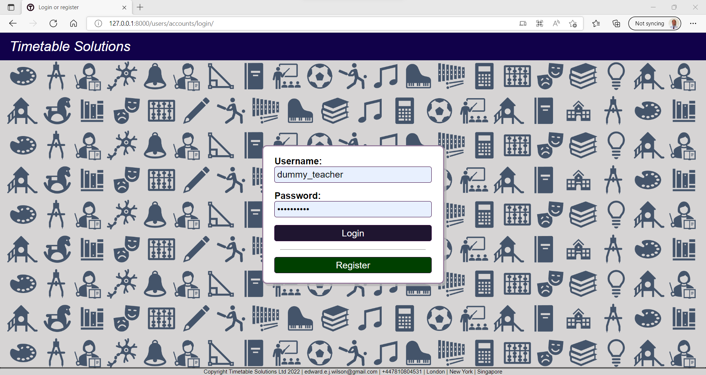
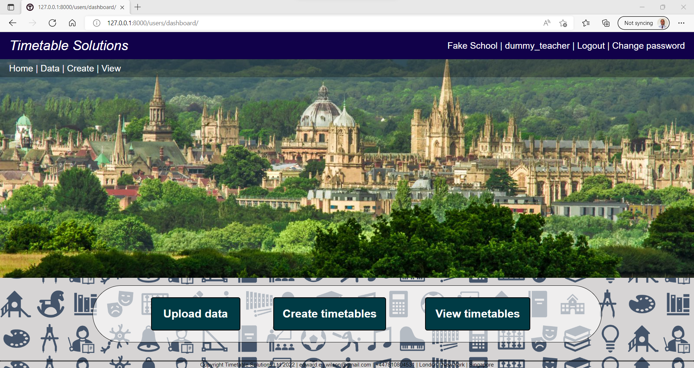
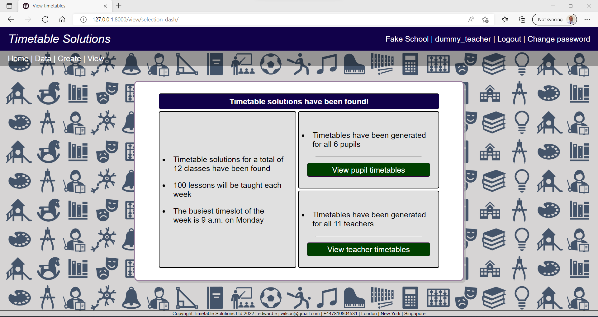
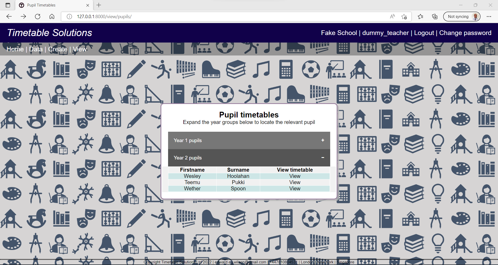
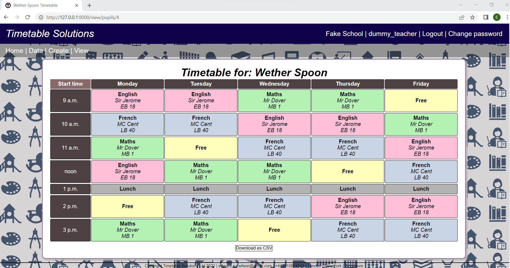
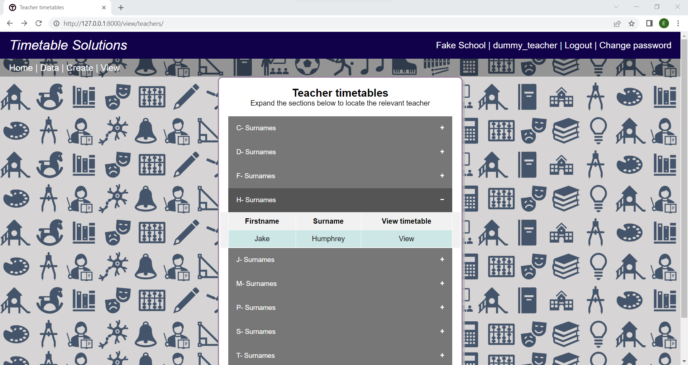

<h2>Timetable scheduling solutions web application implemented in django</h2>

This is a WIP project, to create a timetabling service for schools. 
The core functionality of the application is / will be:

<ol>
    <li>Create an account and register the school</li>
    <li>Upload teacher/pupils/classrooms data for the year</li>
    <li>Upload the classes that must take place, and any classes that must take place at a certain time</li>
    <li>Set priorities for the timetable structure (e.g. to maximise spread of each class throughout week)</li>
    <li>Formulate the timetabling problem as a linear programming problem</li>
    <li>Call a linear optimisation API</li>
    <li>Make the timetables created available for viewing / download in the app</li>
</ol>

<h2>Project setup</h2>
<ol>
    <li>Fork and clone repository</li>
    <li>Setup virtual environment</li>
    <li>Install the dependencies from requirements.txt (with pip is fine)</li>
    <li>
        The project is configured to use pytest-django - at src/timetable_solutions/: 
        <code>pytest</code>
    </li>
    <li>
        Migrate the models (the migrations are all committed) 
        <code>python manage.py migrate</code>
    </li>
    <li>Install the fixtures if you want some dummy data to view, by running scripts/load_all_fixtures.py:
    <li>
        Alternatively, create/upload your own data through the app.
    </li>
</ol>

<h2>Project structure</h2>
The project is split into the following components:
#### Data
- This is a django app defining ALL models used throughout the project as well as all fixtures and migrations
- Each model is defined in its own module and then imported into models/__init__.py
#### Domain
- This defines logic used by the application e.g. processing user specified timetable requirements
- The <b>solver</b> is also implemented here. Note however that the solver subdirectory has been intentionally designed such that it could
live in an entirely separate repository (i.e. is completely independent in its implementation from the rest of the 
project, only using a REST API to load data rather than just calling the data layer directly. This is evidently 
pointless and sub-optimal, but I wanted to have a go at implementing and using a REST API using the django rest
framework - see: interfaces/api_to_solver.
#### Interfaces
- Contain django apps relating to different parts of the user interface
- Each app contains a mixture of views, forms, templates, css and other static files
#### Tests
- These all live in tests/ rather than being located within each app
- The test runner used is pytest-django

<h2>User interface and usage overview</h2>

<h4>User authentication</h4>

<ul>
    <li>The application is setup such that users can register an account and login etc.</li>
    <li>Users must associate themselves with a school, which is achieved using an access key</li>
</ul>

<h4>User dashboard</h4>

The dashboard shows the 3 main functionalities that the application has

<ul>
    <li>Uploading data relating to the schools</li>
    <li>Specifying requirements / preferences for generating timetable solutions</li>
    <li>Viewing and downloading the timetables</li>
</ul>

<h4>Timetable viewing dashboard</h4>

<ul>
    <li>Users can navigate to the solutions found for all pupil / teacher timetables from the 'selection dashboard'</li>
</ul>

<h4>Pupil navigator</h4>

<ul>
    <li>Pupils are indexed by their year group</li>
</ul>

<ul>
    <li>The list of pupils within each year group can be expanded out</li>
</ul>

<h4>Pupil timetable view</h4>

<ul>Timetables can be downloaded as a csv file
    <li>Subjects are colour coordinated</li>
    <li></li>
</ul>

<h4>Teacher navigator</h4>

<ul>
    <li>Teachers are indexed by their surname</li>
    <li>Teachers within a surname letter can be expanded out</li>
</ul>

