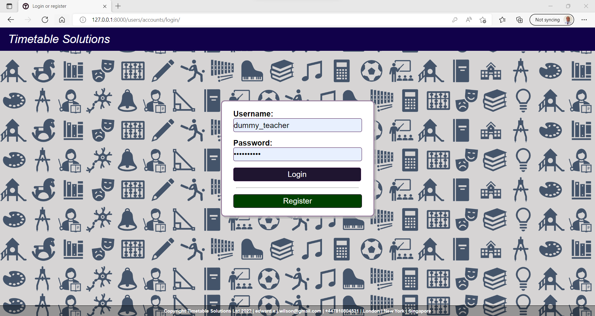
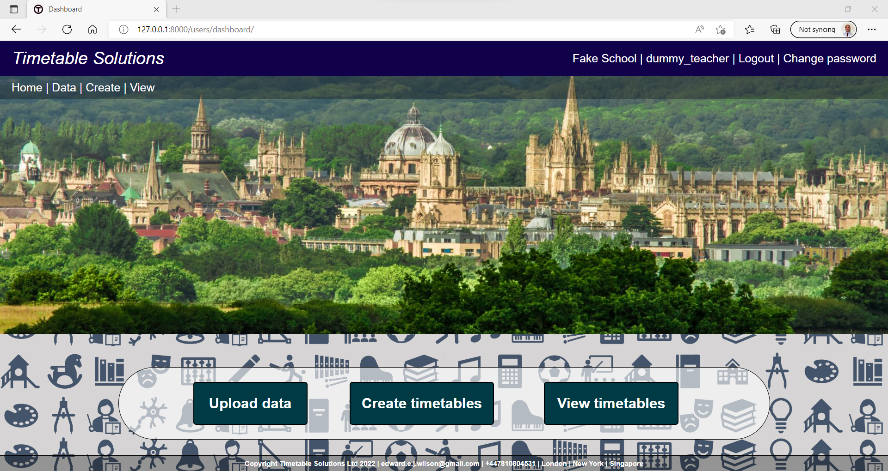
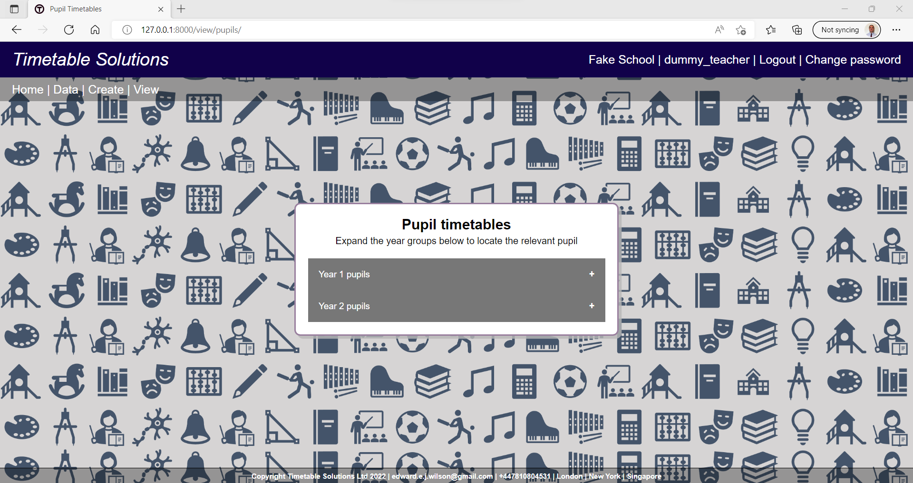
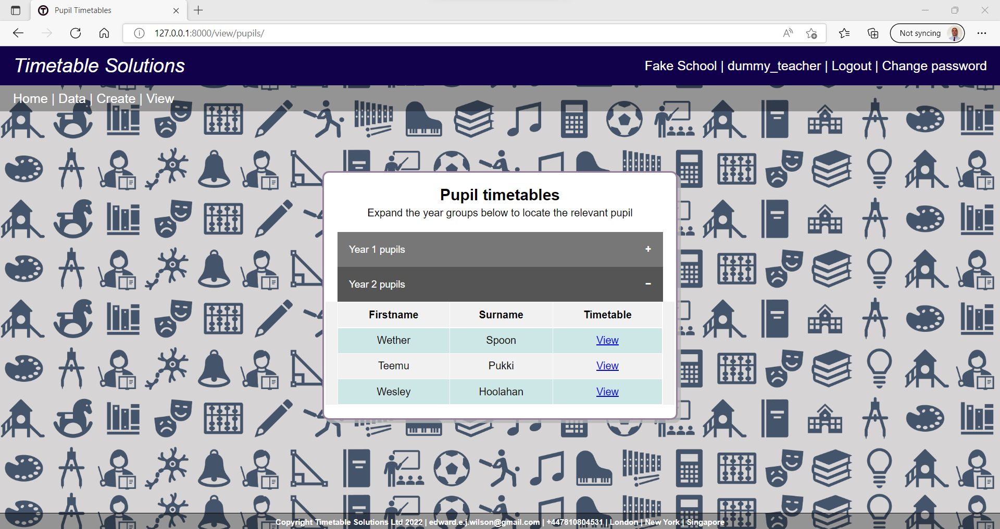
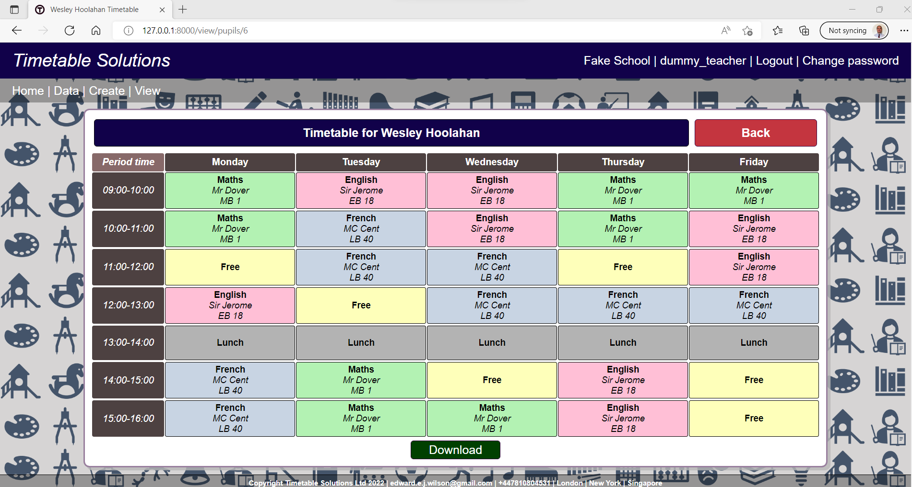

<h2>Timetable scheduling solutions web application implemented in django</h2>

This is a WIP project, to create a timetabling service for schools. 
The core functionality of the application is / will be:

<ol>
    <li>Create an account and register the school</li>
    <li>Upload teacher/pupils/classrooms data for the year</li>
    <li>Upload the classes that must take place, and any classes that must take place at a certain time</li>
    <li>Set priorities for the timetable structure (e.g. to maximise spread of each class throughout week)</li>
    <li>Formulate the timetabling problem as a linear programming problem</li>
    <li>Call a linear optimisation API</li>
    <li>Make the timetables created available for viewing / download in the app</li>
</ol>

<h2>Project setup</h2>
<ol>
    <li>Fork and clone repository</li>
    <li>Setup virtual environment</li>
    <li>Install the dependencies from requirements.txt (with pip is fine)</li>
    <li>
        Check tests are working - once in the timetable directory: 
        <code>python manage.py test</code>
    </li>
    <li>
        Migrate the models (the migrations are all committed) 
        <code>python manage.py migrate</code>
    </li>
    <li>Install the fixtures if you want some dummy data to view, by running scripts/load_all_fixtures.py:
    <li>
        Alternatively, create/upload your own data through the app.
    </li>
</ol>

<h2>User interface and usage overview</h2>

<h4>User authentication</h4>

<ul>
    <li>The application is setup such that users can register an account and login etc.</li>
    <li>Users must associate themselves with a school, which is achieved using an access key</li>
</ul>

<h4>User dashboard</h4>

The dashboard shows the 3 main functionalities that the application has

<ul>
    <li>Uploading data relating to the schools</li>
    <li>Specifying requirements / preferences for generating timetable solutions</li>
    <li>Viewing and downloading the timetables</li>
</ul>

<h4>Timetable viewing dashboard</h4>

<ul>
    <li>Users can navigate to the solutions found for all pupil / teacher timetables from the 'selection dashboard'</li>
</ul>

<h4>Pupil navigator</h4>

<ul>
    <li>Pupils are indexed by their year group</li>
</ul>

<ul>
    <li>The list of pupils within each year group can be expanded out</li>
</ul>

<h4>Pupil timetable view</h4>

<ul>Timetables can be downloaded as a csv file
    <li>Subjects are colour coordinated</li>
    <li></li>
</ul>

<h4>Teacher navigator</h4>

<ul>
    <li>Teachers are indexed by their surname</li>
    <li>Teachers within a surname letter can be expanded out</li>
</ul>

